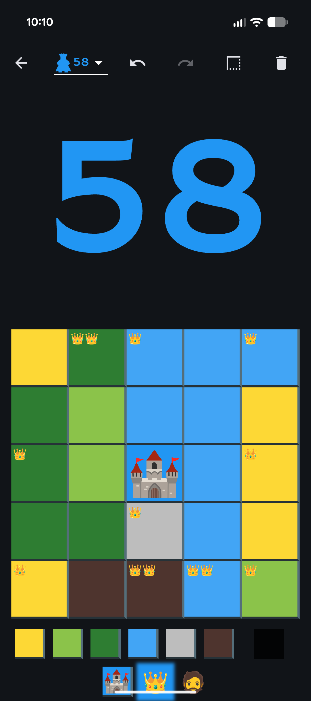
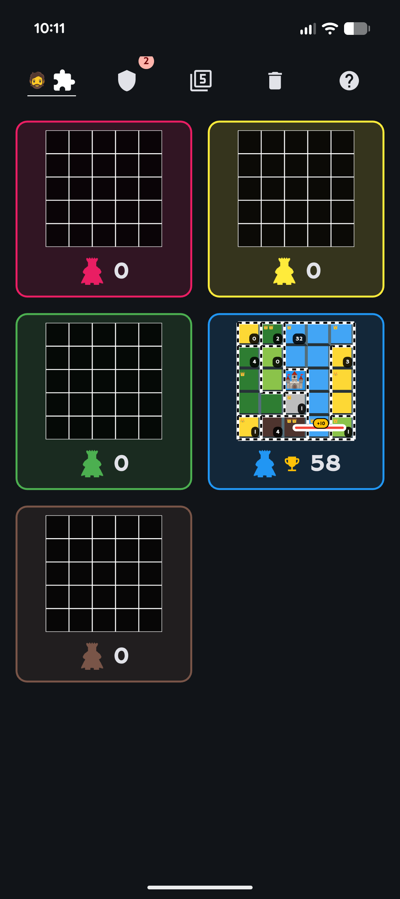
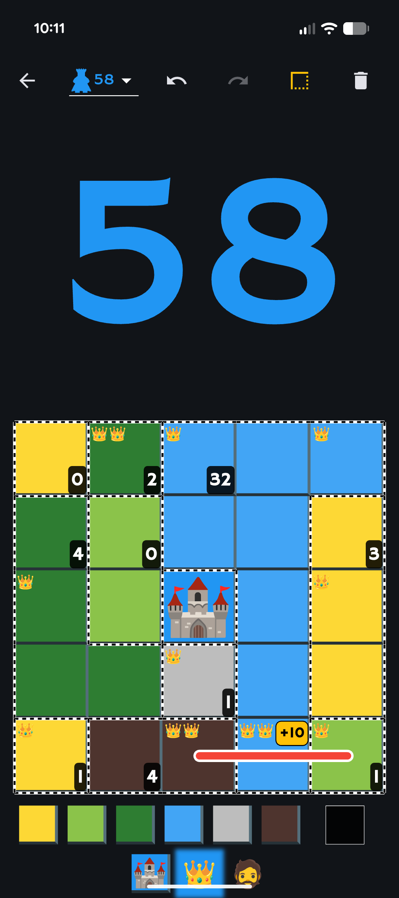

# kingdomino Score

Calculate your "Kingdomino" and "Kingdomino Age of Giants" score easily

Available for :

# Top menu buttons

## On global menu

* Extension menu : Activate an extension
  * Age of Giants
  * La cour
  * Lost treasures
* Shield : Select / Unselect quests
    * Two quests maximum can be selected at a time.
    * There are more quests when Age of Giants is activated
    * The number of quests activated is displayed in a red bubble
* 5 / 7 : change the size of the board. Changing the size of the board reset all tiles
* Trash : Reset all boards
* About : Display author and license

## On board menu

* Go back to global menu
* Undo
* Redo
* Overlay mode: display score per domains
* Trash: reset current board

# Score

The score is updated as each change on the board.

In portrait mode, tapping the score display the calculation details. 

# Bottom menu buttons

Each land type has it's own color :

* Yellow : Wheat
* Light green : Grassland
* Dark green : Forest
* Blue : Lake
* Grey : Swamp
* Brown : Mine
* Grey : Empty
* Castle : Place your castle.

The castle position may change the score when quests are activated.

* Crown : Place / remove crowns
* Giant (when Aog is activated) : Place / remove giants.

Long press on the giant button displays the giant details :
* how many crowns points are lost per property
* how many quests points are lost (or gained in case of bleak king quest)
* total points lost due to giants
* the score you could had have without giants

# Screenshots

|  |  |  |
|-----------------------------------------------------------------------------------------------|----------------------------------------------------------------------------------------------|-------------------------------------------------------------------------------------------------|

# Assets credits and licenses

## Cross SVG Vector

By SVG Repo under the CC0 License

https://www.svgrepo.com/svg/36886/cross

## Trash SVG Vector

By SVG Repo under the CC0 License

https://www.svgrepo.com/svg/120929/trash

## Shield SVG Vector

By SVG Repo under the CC0 License

https://www.svgrepo.com/svg/50826/shield

## Turn Right Arrow SVG Vector

By SVG Repo under the CC0 License

https://www.svgrepo.com/svg/165935/turn-right-arrow

## Checkmark SVG Vector

By SVG Repo under the CC0 License

https://www.svgrepo.com/svg/9459/check

## Crown SVG Vector

By SVG Repo under the CC0 License

https://www.svgrepo.com/svg/188702/crown

## Castle SVG Vector

By SVG Repo under the CC0 License

https://www.svgrepo.com/svg/40220/castle

## Wood Board Wood SVG Vector

By SVG Repo under the CC0 License

https://www.svgrepo.com/svg/284283/wood-board-wood
