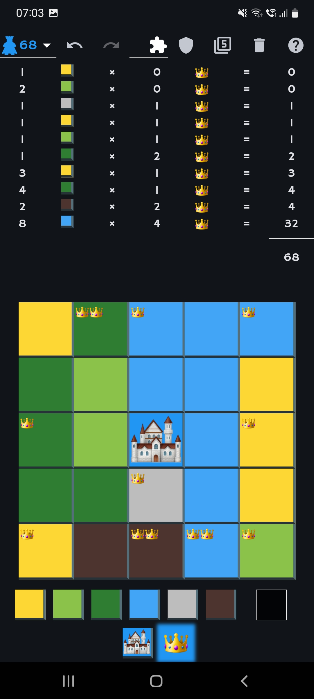

# kingdomino Score

Calculate your "Kingdomino" and "Kingdomino Age of Giants" score easily

Available for :

* [Android Google play store](https://play.google.com/store/apps/details?id=fr.odrevet.kingdomino_score_count)
* [Online with a web browser](https://odrevet.github.io/kingdomino_score)

# Top menu buttons

* Warnings (only displayed when at least on warning): check board for anomalities
* AG : Activate / Deactivate the Age of Giants extension
* Shield : Select / Unselect quests
    * Two quests maximum can be selected at a time.
    * There are more quests when Age of Giants is activated
    * The number of quests activated is displayed in a red bubble

* 5 / 7 : change the size of the board. Changing the size of the board reset all tiles
* Trash : Reset the board
* About : Display author and license

# Score

The score is updated as each change on the board.

In portrait mode, tapping the score display the calculation details. 

# Bottom menu buttons

Each land type has it's own color :

* Yellow : Wheat
* Light green : Grassland
* Dark green : Forest
* Blue : Lake
* Grey : Swamp
* Brown : Mine
* Grey : Empty
* Castle : Place your castle.

The castle position may change the score when quests are activated.

Long press the castle button opens the color select dialog (this is optional and never changes the score).

* Crown : Place / remove crowns
* Giant (when Aog is activated) : Place / remove giants.

Long press on the giant button displays the giant details :
* how many crowns points are lost per property
* how many quests points are lost (or gained in case of bleak king quest)
* total points lost due to giants
* the score you could had have without giants

# Screenshots

|   |
|---|
|   |

# TroubleShooting

## In the online version, crowns and castle are replaced with squares

You need to have emoticon support to display some graphics like crowns and castle.

Under Ubuntu :

```
sudo apt install fonts-emojione
```

and then set emojione as the standard font in your web browser


# Assets credits and licenses

## Cross SVG Vector

By SVG Repo under the CC0 License

https://www.svgrepo.com/svg/36886/cross

## Trash SVG Vector

By SVG Repo under the CC0 License

https://www.svgrepo.com/svg/120929/trash

## Shield SVG Vector

By SVG Repo under the CC0 License

https://www.svgrepo.com/svg/50826/shield

## Turn Right Arrow SVG Vector

By SVG Repo under the CC0 License

https://www.svgrepo.com/svg/165935/turn-right-arrow

## Checkmark SVG Vector

By SVG Repo under the CC0 License

https://www.svgrepo.com/svg/9459/check

## Crown SVG Vector

By SVG Repo under the CC0 License

https://www.svgrepo.com/svg/188702/crown

## Castle SVG Vector

By SVG Repo under the CC0 License

https://www.svgrepo.com/svg/40220/castle

## Wood Board Wood SVG Vector

By SVG Repo under the CC0 License

https://www.svgrepo.com/svg/284283/wood-board-wood